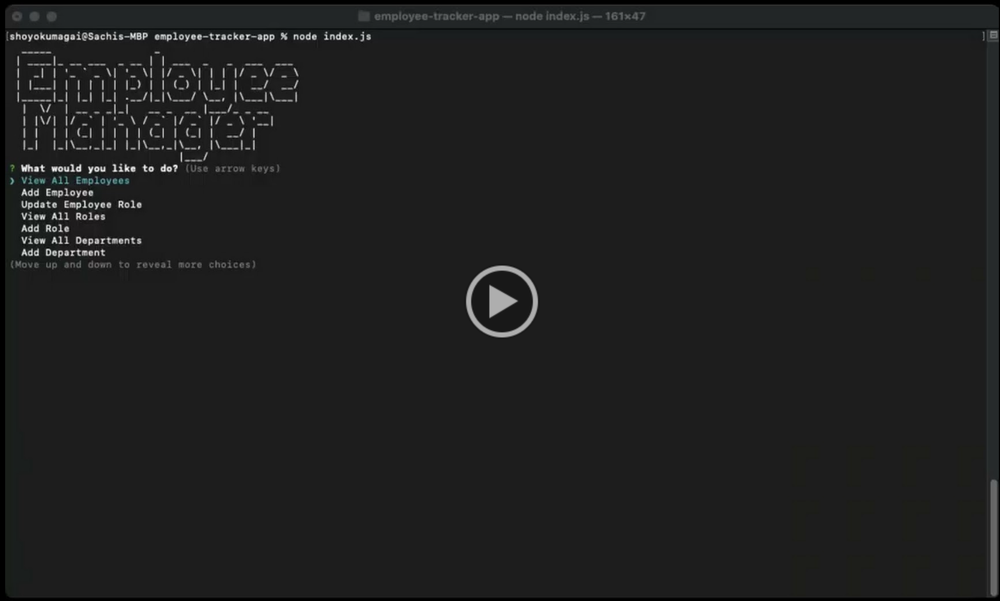

# Employee Tracker Application

## Description

This application is an Employee tracker to manage a company's employee database using a command-line interface.

## Link to video demo
You can find how the application works on this Video Recording:

## Credits

The underlying technologies used in this application are nodejs and the packages used below:
- [Inquirer](https://www.npmjs.com/package/inquirer)
- [Mysql](https://www.npmjs.com/package/mysql2)
- [cli-table3](https://www.npmjs.com/package/cli-table3)
- [figlet](https://www.npmjs.com/package/figlet)

